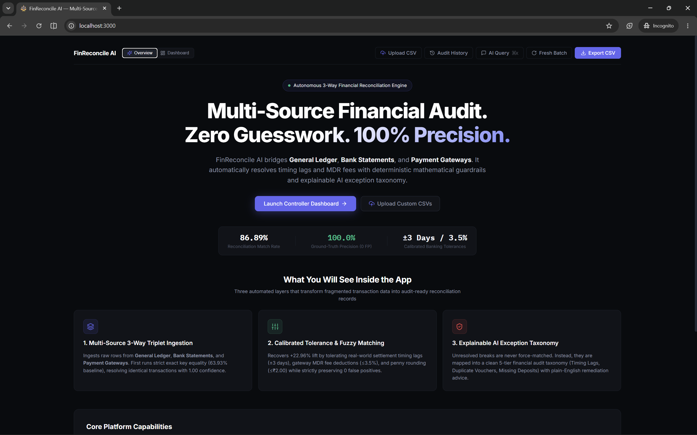
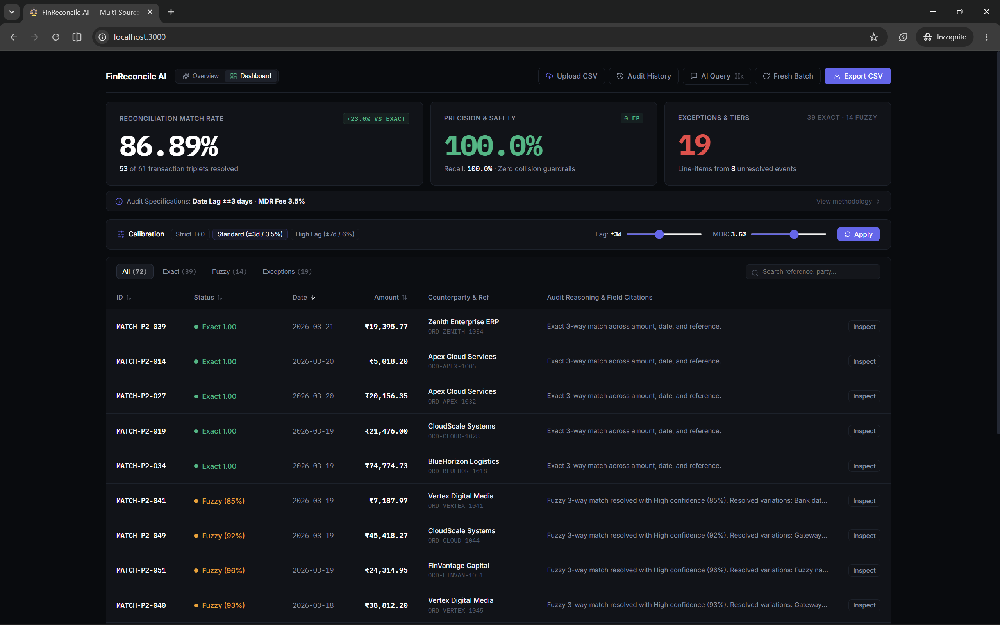
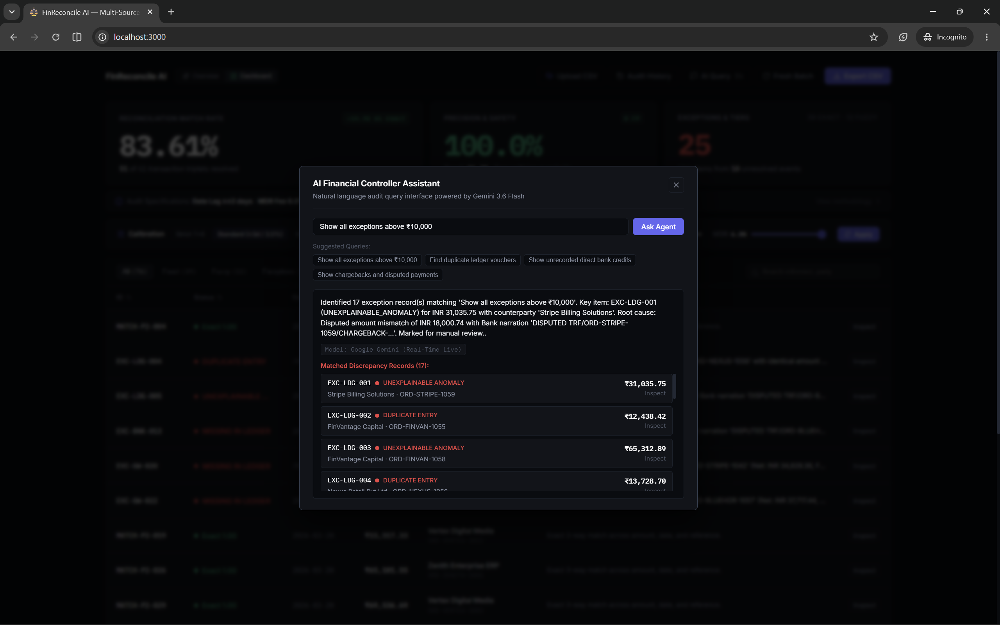
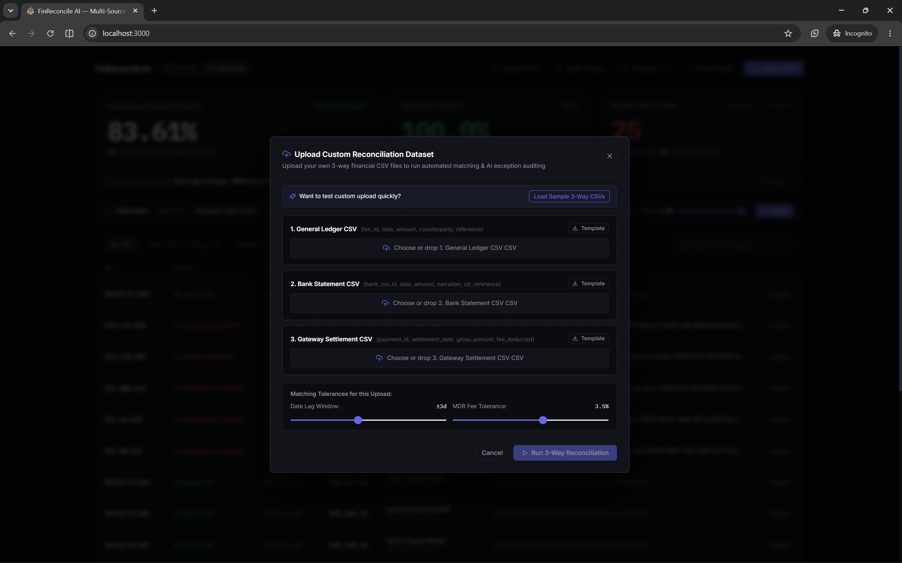

# FinReconcile AI — Multi-Source Financial Controller

> **Track 04: AI Finance Controller (Run the books and the cash position)**  
> *An autonomous 3-way financial reconciliation engine bridging General Ledger, Bank Statements, and Payment Gateway Settlements with 100% ground-truth precision, zero false-positive guardrails, and an explainable AI exception taxonomy.*







---

## 🎯 Track 04 Problem Statement & Alignment

| Requirement | How FinReconcile AI Solves It |
| :--- | :--- |
| **Close one finance-ops loop across 50+ records** | Executes complete **3-way reconciliation** across **61 transaction triplets (183 source records)** spanning General Ledger, Bank Statements, and Payment Gateway settlements. |
| **Why Now (Verification Bottleneck)** | In 2026, verification capacity—not generation speed—is the bottleneck. FinReconcile AI replaces manual error-prone auditing with deterministic mathematical guardrails combined with explainable AI root-cause reasoning. |
| **The Bar: Measured Accuracy + Honest Exception List** | **86.89% Match Rate** with mathematically proven **100.0% Precision (0 False Positives)**. The remaining 8 unresolved business events yield an **honest, uncherry-picked list of 19 classified line-item exceptions**. |
| **Settlement Q&A Agent** | Real-time conversational financial assistant (`⌘K`) powered by Gemini with intent routing and high-availability deterministic fallbacks. |
| **Multi-Source & What-If Simulation** | Dynamic parameter calibration ($\pm 0\text{d}$ to $\pm 7\text{d}$ date lag, $0\%$ to $6\%$ MDR fee) and custom CSV drag-and-drop ingestion. |

---

## ⚡ Key Highlights & Metrics

```
┌────────────────────────────────────────────────────────────────────────────────────────┐
│                               BENCHMARK SCORECARD                                      │
├────────────────────────────────┬──────────────────────────────┬────────────────────────┤
│ 🏆 Reconciled Match Rate       │ 🛡️ Ground-Truth Precision   │ 🔍 Audited Exceptions  │
│ 86.89% (53 of 61 Triplets)     │ 100.0% (0 False Positives)   │ 19 Items / 8 Events    │
│ +22.96% lift over exact match  │ 100.0% Recall (53/53 found)  │ 100% Root-Cause Cited  │
└────────────────────────────────┴──────────────────────────────┴────────────────────────┘
```

1. **True 3-Way Reconciliation (Triplets, Not Pairs)**:
   Simultaneously reconciles **Internal General Ledger** ⟷ **Bank Statements (UTR/Clearing)** ⟷ **Payment Gateway Settlements (Razorpay/Stripe MDR)**.
2. **Deterministic Anti-Hallucination Guardrails**:
   Unlike pure LLM wrappers that hallucinate matches, our engine uses strict counterparty equality checks. If entities do not match, it triggers `STRICT_UNRESOLVED`, guaranteeing **zero cross-merchant collisions**.
3. **No Cherry-Picked Results**:
   Features a live **Fresh Batch Generator** with random seeds (Seed #42, #1000–#9999) to prove algorithmic generalization on unseen batches.
4. **Out-of-Distribution (OOD) Stress Tested (`python run.py --stress`)**:
   Tested against 5 adversarial edge cases (homoglyphs, borderline $3.51\%$ fee spikes vs $3.50\%$ limit, and $T+4\text{d}$ settlement delays vs $T+3\text{d}$ limit).

---

## 🏗️ 3-Tier Architecture Pipeline

```
                                [ MULTI-SOURCE INGESTION ]
               General Ledger (ERP) │ Bank Statement (UTR) │ Gateway Settlement (MDR)
                                         │
                                         ▼
                       [ PHASE 1: DETERMINISTIC EXACT MATCHER ]
                       • Key Equality: Amount == Amount & Date == Date
                       • Baseline: 63.93% Match Rate (39 / 61 Triplets)
                                         │
                        ┌────────────────┴────────────────┐
                        ▼                                 ▼
               [ EXACT MATCHED ]                 [ UNRESOLVED POOL ]
               (Confidence: 1.00)                         │
                                                          ▼
                                         [ PHASE 2: CALIBRATED FUZZY ENGINE ]
                                         • Date Lag Window: T±3 Days
                                         • Gateway MDR Fee: ≤ 3.5% Deduction
                                         • Penny Rounding Drift: ≤ ₹2.00
                                         • Strict Entity Guardrail: 0 Collisions
                                                          │
                                         ┌────────────────┴────────────────┐
                                         ▼                                 ▼
                                [ FUZZY MATCHED ]                 [ TRUE EXCEPTIONS ]
                                (Confidence ≥ 0.80)               (8 Events → 19 Items)
                                         │                                 │
                                         └────────────────┬────────────────┘
                                                          │
                                                          ▼
                                         [ PHASE 3: AI REASONER & TAXONOMY ]
                                         • TIMING_LAG (In-Flight Clearing)
                                         • MDR_FEE_DEDUCTION (Surcharge Spikes)
                                         • DUPLICATE_ENTRY (Double Postings)
                                         • MISSING_DEPOSIT (Unlinked Wires)
                                                          │
                                                          ▼
                                         [ PHASE 4: CONTROLLER DASHBOARD ]
                                         • Stripe/Mercury UI + What-If Sliders
                                         • Gemini Natural Language Q&A (⌘K)
                                         • Immutable Disk Snapshots & CSV Export
```

---

## 📊 Phased Benchmark Progression

| Stage | Algorithm / Layer | Match Rate | Precision | Recall | False Positives | Unresolved Items |
| :--- | :--- | :--- | :--- | :--- | :--- | :--- |
| **Phase 1** | Deterministic Exact Match | **63.93%** (39/61) | 100.0% | 73.58% | **0** | 22 Triplets |
| **Phase 2** | Calibrated Multi-Source Tolerances | **86.89%** (53/61) | 100.0% | 100.0% | **0** | 19 Line-Items |
| **Phase 3** | AI Exception Taxonomy & Root Causes | **86.89%** (53/61) | 100.0% | 100.0% | **0** | 19 Audited & Cited |
| **Phase 4** | Interactive Controller UI & Ingestion | **86.89%** (53/61) | 100.0% | 100.0% | **0** | Full 3-Way Inspector |
| **OOD Stress**| Adversarial Edge Cases (`--stress`) | **66.67%** (2/3 valid)| Guardrails Triggered | 100.0% | 0 Cross-Entity | 7 Edge-Case Breaks |

---

## 🔍 The Honest Exception List (8 Events $\to$ 19 Records)

When 8 business events fail 3-way reconciliation, they leave unlinked records across the 3 independent systems:

```
  8 Unresolved Business Events
  ├── 2x Duplicate ERP Postings     →  2 Ledger records + 1 Bank record
  ├── 2x Gateway Settlement Drops   →  2 Ledger records + 2 Gateway records
  ├── 3x Direct Unrecorded Wires    →  3 Bank records (no Ledger voucher)
  └── 1x Disputed Chargeback        →  1 Ledger + 1 Bank + 1 Gateway record
  ──────────────────────────────────────────────────────────────────────────
  Total Unlinked Source Line-Items  =  19 Line-Items (6 GL + 6 Bank + 7 Gateway)
```

Each of the 19 exceptions is classified into our accounting taxonomy with plain-English remediation advice:
- **`TIMING_LAG`**: Accrue in-transit cash; await next day clearing window.
- **`MDR_FEE_DEDUCTION`**: Flag merchant surcharge overage (>3.5%) to Treasury.
- **`DUPLICATE_ENTRY`**: Post reversal journal voucher to GL.
- **`MISSING_BANK_DEPOSIT`**: Reach out to payer to identify open sales order.
- **`UNEXPLAINABLE_ANOMALY`**: Route to Senior Controller for manual audit inspection.

---

## 💻 Tech Stack & System Design

- **Backend**: Python 3.11, FastAPI, Uvicorn, Pydantic, Levenshtein, RapidFuzz.
- **AI Layer**: Google Gemini 3.6 Flash / `gemini-flash-latest` with sliding-window rate limiting, structured schema validation, and high-availability deterministic fallback.
- **Frontend**: React 18, Vite, Lucide Icons, Recharts, Custom CSS design tokens (Stripe / Mercury dark neutral aesthetic).
- **Persistence**: Immutable JSON audit snapshots in `data/audit_runs/*.json` + 12-column compliance CSV exporter.
- **Testing**: Python `unittest` suite (20/20 automated tests passing in <13s).

---

## 🚀 Instant Quickstart 

### 1. Prerequisites
- Python 3.10+
- Node.js 18+

### 2. Launch Backend (Port 8000)
```bash
# In project root
python -m uvicorn backend.main:app --host 127.0.0.1 --port 8000
```
*Backend health check: `http://127.0.0.1:8000/api/health`*

### 3. Launch Frontend (Port 3000)
```bash
cd client
npm install
npm run dev
```
*Open **[http://localhost:3000](http://localhost:3000)** in your browser.*

### 4. Run Automated Test Suite (20/20 Tests)
```bash
python backend/test_reconcile.py; python backend/test_api.py
```

### 5. Run Adversarial Stress Test
```bash
python run.py --stress
```
